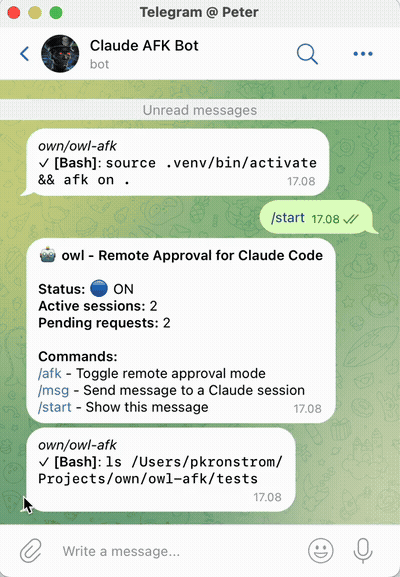

# owl


Remote approval system for Claude Code via Telegram. Approve or deny tool calls from your phone while away from your computer.

Part of [**Nest-Driven Development**](https://github.com/pkronstrom/nest-driven-development) — the minimum vibable workflow.



## Features

- **Telegram Integration**: Receive approval requests on Telegram with inline buttons
- **Smart Pattern Rules**: Create rules to auto-approve commands matching patterns (e.g., `Bash(git *)`, `Edit(*.py)`)
- **Chain Command Support**: Handle complex bash chains like `git add . && git commit -m "msg"`
- **Wrapper Detection**: Recognizes SSH, Docker, sudo, and other wrapper commands
- **Project-Scoped Rules**: Auto-approve edits within specific projects
- **Subagent Notifications**: Get notified when Claude's subagents complete
- **Session Notifications**: Get notified on session start/end and context compaction
- **Notification Forwarding**: Forward Claude's notifications to Telegram
- **Project Filters**: Enable owl only for specific projects

## Installation

```bash
# With uv (recommended)
uv tool install git+https://github.com/pkronstrom/owl-afk

# With pipx
pipx install git+https://github.com/pkronstrom/owl-afk

# Development (editable install)
git clone https://github.com/pkronstrom/owl-afk
cd owl-afk
uv sync
```

## Setup

### 1. Create a Telegram Bot

1. Message [@BotFather](https://t.me/BotFather) on Telegram
2. Send `/newbot` and follow the prompts
3. Save the bot token

### 2. Get Your Chat ID

1. Message your new bot
2. Visit `https://api.telegram.org/bot<YOUR_TOKEN>/getUpdates`
3. Find your `chat.id` in the response

### 3. Configure owl

```bash
owl install
```

This will prompt for your bot token and chat ID, then set up Claude Code hooks.

## Usage

### Enable/Disable

```bash
owl on   # Enable remote approval
owl off  # Disable (auto-approves pending requests)
```

### Check Status

```bash
owl status
```

### Manage Rules

```bash
owl rules list              # List all rules
owl rules add "Bash(git *)" # Add a rule
owl rules remove 1          # Remove rule by ID
```

### Debug Mode

```bash
owl debug on   # Enable debug logging to ~/.config/owl/debug.log
owl debug off  # Disable debug logging
```

### Environment Overrides

```bash
owl env list           # List env var overrides
owl env set KEY value  # Set an override
owl env unset KEY      # Remove an override
```

## Telegram Commands

Once a request comes in, you'll see inline buttons:

- **Approve** / **Approve Step**: Approve the current command
- **Approve Chain**: Approve all commands in a chain at once
- **Rule**: Create a pattern rule for future auto-approval
- **All [Tool]**: Approve all pending + add rule for this tool type
- **Deny** / **Deny+Msg**: Deny with optional feedback message

### Pattern Examples

| Pattern | Matches |
|---------|---------|
| `Bash(git *)` | Any git command |
| `Bash(ssh aarni *)` | Any command on host "aarni" |
| `Edit(*.py)` | Any Python file edit |
| `Edit(/path/to/project/*)` | Any edit in project |
| `Read(*)` | Any file read |

## Architecture

```
~/.config/owl/
├── mode           # "on" or "off"
├── owl.db       # SQLite database (requests, rules, sessions)
├── debug.log      # Debug log (when enabled)
└── config.json    # Bot token and chat ID
```

owl uses Claude Code hooks to intercept tool calls:
- `PreToolUse` - Intercepts before tool execution
- `PostToolUse` - Delivers queued messages
- `PermissionRequest` - Handles permission/trust prompts
- `SessionStart` / `SessionEnd` - Session lifecycle notifications
- `PreCompact` - Notifies before context compaction
- `Stop` - Interactive confirmation before Claude stops
- `SubagentStop` - Notifies when subagents complete

## Hawk-Hooks Integration

owl can also be used with [hawk-hooks](https://github.com/pkronstrom/hawk-hooks) as the hook manager. See [extras/hawk-hooks/README.md](extras/hawk-hooks/README.md) for setup instructions.

## Requirements

- Python 3.10+
- Claude Code CLI with hooks support
- Telegram account

## Security Considerations

### Credential Storage

- Telegram bot token and chat ID are stored in `~/.config/owl/config.json`
- File permissions are automatically set to `0600` (owner read/write only)
- Do not commit config.json to version control
- Limit filesystem access to trusted users

### Approval Security

- owl intercepts and gates Claude Code tool calls
- Commands approved by you are executed by Claude Code, not owl
- owl cannot prevent malicious commands if you approve them
- Review all commands carefully before approving

### Debug Mode

- Debug logs may contain sensitive information (commands, file paths, session data)
- Only enable debug mode when troubleshooting
- Debug logs stored in `~/.config/owl/debug.log`

### Network Security

- owl communicates with Telegram API over HTTPS
- Telegram bot token transmitted in URL path (standard Telegram API practice)
- No user data leaves your machine except to your own Telegram bot

## License

MIT
